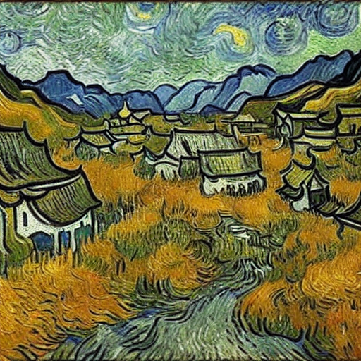
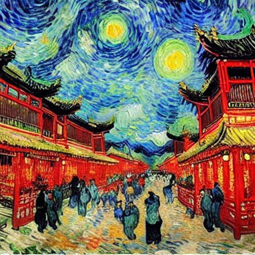
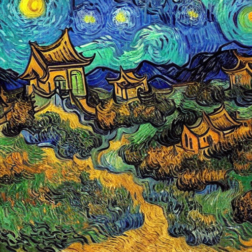

# 🚀 AutoPrompt2Image

<p align="center">
  
  
  
</p>

<p align="center">
  <b>LLM-powered prompt optimization for Stable Diffusion with LoRA-enhanced image generation.</b>
</p>

<p align="center">
  Turn natural language into high-quality AI-generated images.
</p>

AutoPrompt2Image is an end-to-end pipeline that leverages a LLaMA-based language model to transform raw user input into high-quality, diffusion-ready prompts, and generates images using a LoRA fine-tuned Stable Diffusion model.

---

## ✨ Features

* 🔹 **Automatic Prompt Engineering** via LLaMA
* 🔹 **LoRA Fine-tuned Stable Diffusion** for style consistency
* 🔹 **End-to-End Text-to-Image Pipeline**
* 🔹 **Custom Dataset Training Support**
* 🔹 **Modular Design** (easy to extend or replace components)

---

## 🧩 Pipeline

```text
User Input
   ↓
LLaMA (Prompt Optimization)
   ↓
Optimized Prompt
   ↓
LoRA Stable Diffusion
   ↓
Generated Image
```


## ⚙️ Installation

```bash
git clone https://github.com/J-damn649/AutoPrompt2Image.git
cd AutoPrompt2Image

pip install -r requirements_genimage.txt
pip install -r requirements_gendata.txt
```

---

## 🚀 Usage

```bash
python scripts/main.py --prompt "a cat in van gogh style"
```

---

## 📁 Project Structure

```text
AutoPrompt2Image/
│── scripts/        # inference / entry scripts
│── models/         # model checkpoints (not included)
│── trainer/        # training code (LoRA, SFT)
│── dataset/        # training data (not included)
│── outs/           # generated images             
│── requirements_gendata.txt
│── requirements_genimage.txt
│── README.md
```

---

## 🧠 How It Works

1. User provides a natural language description
2. LLaMA refines it into a structured prompt
3. Prompt is fed into Stable Diffusion
4. LoRA enhances style and consistency
5. Final image is generated

---

## 🙌 Acknowledgements

* Stable Diffusion
* HuggingFace Diffusers
* LLaMA / Transformers
* PEFT (LoRA)

---

## ⭐ If you like this project

Give it a star ⭐ on GitHub!
